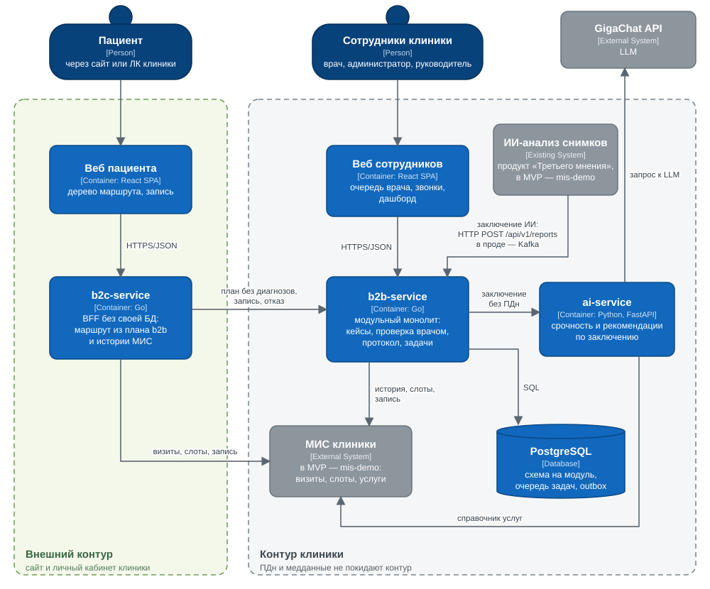

# Маршрут после находки

Сервис ведёт пациента от заключения ИИ по снимку (КТ, рентгенография, маммография) до записи на нужный приём. Заключение готовит продукт «Третьего мнения» для ИИ-анализа снимков, уже встроенный в контур клиники; его результат и запускает весь путь. ИИ предлагает срочность и маршрут, врач проверяет и подтверждает его. Дальше пациент записывается сам в дереве маршрута, а если не записался — ему звонит администратор. Руководитель видит воронку и SLA.

Сервис не ставит диагноз: это организационная навигация с обязательным подтверждением врача. Пациент не видит ни находок, ни диагнозов — только понятное объяснение следующих шагов.

Команда МедиДруны, кейс «Третье мнение».

## Стек

| Часть | Технологии |
|---|---|
| b2b-service, b2c-service, mis-demo | Go 1.26: `net/http`, uber/fx, zap, pgx/v5, goose, avito-tech/go-transaction-manager, caarlos0/env |
| ai-service | Python 3.12, FastAPI, SDK gigachat; LLM — GigaChat |
| Хранилище | PostgreSQL 17. Очередь задач и outbox — таблицы в той же базе, брокера нет |
| Фронт | React 19, TypeScript 6, Vite 8, React Router 8, TanStack Query 5, Tailwind CSS 4, Recharts 3; статику отдаёт nginx |
| Запуск и тесты | Docker Compose; e2e на testcontainers (Go), pytest (ai-service) |

## Сервисы

| Сервис | Порт | Контур | Зона ответственности |
|---|---|---|---|
| [b2b-service](services/b2b-service/README.md) | 8080 | клиника | Приём заключений ИИ-анализа, оценка через ai-service, очередь и проверка врачом, протокол таймеров и уведомлений, задачи администратора, запись в МИС, дашборд. Модульный монолит: `gateway`, `doctor`, `care`, `system` |
| [ai-service](services/ai-service/README.md) | 8083 | клиника | Срочность и рекомендации по заключению: правила, выдержки клинических рекомендаций и LLM. Рекомендует только услуги из справочника МИС |
| b2c-service | 8082 | внешний | BFF пациента без своей БД: собирает маршрут из плана b2b-service и истории МИС, запись, отказ, просьба перезвонить |
| mis-demo | 8081 | — | Демо-МИС в памяти вместо настоящей: пациенты, визиты, справочник услуг, слоты, запись, демо-часы. Заодно имитирует ИИ-анализ снимков: отправляет демо-заключения |
| [web](web/README.md) | 3000 | — | SPA всех ролей и демо-панель. nginx проксирует `/b2b/`, `/mis/`, `/b2c/` на сервисы |

### Как сервисы встраиваются в клинику

- **Вход — ИИ-анализ снимков.** Путь начинается, когда продукт «Третьего мнения», уже встроенный в контур клиники, присылает заключение по снимку. В MVP он вызывает `POST /api/v1/reports` по HTTP (вместо него это делает демо-кнопка mis-demo), в проде будет публиковать заключения в Kafka.
- **b2b-service целиком в контуре клиники.** ПДн и медицинские данные — ФИО, телефоны, тексты заключений — не покидают контур. С МИС он работает по HTTP: забирает историю и слоты, записывает пациента. Веб врача, администратора и руководителя тоже работает только внутри контура.
- **ai-service тоже в контуре.** Он получает деперсонализированный запрос: возраст, пол, модальность, текст заключения, услуги пациента. ФИО, контактов и идентификаторов в запросе нет.
- **b2c-service во внешнем контуре**, рядом с сайтом и личным кабинетом клиники. Своих данных он не хранит. Из b2b-service получает только пациентскую проекцию плана — без диагнозов, находок, обоснований и срочности. Из МИС — визиты, слоты и запись. Аутентификацию пациента делает ЛК клиники, а сам маршрут встраивается в сайт или приложение (есть deep link на шаг).
- **Вызовы идут только снаружи внутрь** по узкому набору ручек: b2c-service → b2b-service и b2c-service → МИС.

API всех сервисов — в [contracts/](contracts/README.md).

## Архитектура

C4, уровень 2 — контейнеры:



Компоненты b2b-service (C4, уровень 3: модули, события через outbox, синхронные вызовы) — в [docs/architecture](docs/architecture/README.md).

## Упрощения MVP

- **МИС и ИИ-анализ — демо.** mis-demo хранит всё в памяти и сбрасывается при перезапуске. Визит появляется, когда демо-время проходит мимо записи. Заключения ИИ-анализа отправляет его демо-кнопка. Настоящей интеграции с МИС/РИС и продуктом ИИ-анализа нет.
- **Уведомления не отправляются.** Push, SMS и эскалации сотрудникам только пишутся в журнал уведомлений.
- **Авторизации нет.** Сотрудник передаёт заголовок `X-User-ID`, пациент определяется по ID в МИС в пути запроса. Считаем, что ЛК клиники его уже авторизовал. Врач и администратор в демо — по одному.
- **LLM в облаке.** ai-service обращается к облачному GigaChat. Деперсонализация только структурная: ФИО и ID не передаются, но свободный текст заключения не обезличивается.
- **Без брокера.** Заключения ИИ-анализа приходят по HTTP, а не из Kafka. Очередь задач и outbox — таблицы в Postgres. ai-service вызывается синхронно из фонового воркера. После 5 неудачных попыток кейс остаётся в `draft`, ошибка только логируется.
- **b2b-service — модульный монолит, а не микросервисы.** Модули изолированы схемами и событиями, распил вынесен в роадмап.
- **Время — часы приложения.** Демо-панель перематывает их кнопками «+30 мин» и «+1 день», все таймеры протокола считаются от них. Дашборд руководителя показывает синтетическую историю за 180 дней, которую создаёт «Сбросить демо».
- **Одно SPA на все роли.** Роли переключаются в демо-панели; в проде часть пациента живёт на сайте или в приложении клиники. Перенос и отмена записи — по телефону клиники, настройки уведомлений пациента — макет.
- **Медицинская часть — черновик.** Выдержки клинических рекомендаций, пороги правил в ai-service и веса прогресса плана должен сверить медэксперт.

## Запуск

Нужен Docker с Compose v2. Для настоящей оценки ИИ нужен ключ GigaChat; без него можно запустить с моком (вариант Б).

**Вариант А — с GigaChat:**

```bash
cp services/ai-service/.env.example services/ai-service/.env
# вписать GIGACHAT_CREDENTIALS, см. «Конфигурация → ai-service»
docker compose up -d --build
```

**Вариант Б — без ключа, с моком ИИ:** в `services/b2b-service/config/docker.env` поставить `AI_SERVICE_MOCK=true`, затем:

```bash
docker compose up -d --build
```

Веб: http://localhost:3000.

| Порт | Что |
|---|---|
| 3000 | веб всех ролей |
| 8080 | b2b-service |
| 8081 | mis-demo |
| 8082 | b2c-service |
| 8083 | ai-service, только `127.0.0.1` |
| 5432 | PostgreSQL |

### Демо-сценарий

Все действия — на демо-панели сверху и в ролях.

1. **«Сбросить демо»** — чистое состояние и синтетическая история для дашборда.
2. **«Симулировать поступление из МИС»** — mis-demo от имени ИИ-анализа отправляет четыре заключения. ai-service оценивает их, и кейсы появляются в очереди врача.
3. **Врач** открывает кейс, ставит отметки и подтверждает. У Сергея неотложный кейс: таймер, задача администратору, эскалации при перемотке «+30 мин».
4. **Пациент:**
   - у Анны дерево маршрута и запись прямо из узла дерева;
   - у Игоря пропущенный шаг из прошлого обследования;
   - у Ольги отклонений нет, только напоминание о профилактике.
5. **«+1 день»** — Игорь не записался вовремя, у администратора появляется задача со скриптом звонка, запись по звонку.
6. **Руководитель** видит воронку, SLA, причины отказов и расчёт эффекта.

### Тесты

```bash
cd services/b2b-service && go test ./internal/... && go test -tags e2e ./tests/e2e/
cd services/b2c-service && go test -tags e2e ./tests/e2e/
cd services/ai-service && .venv/bin/pytest
cd web && npm ci && npm run lint && npm run build
```

e2e на testcontainers собирают сервис из Dockerfile, поэтому нужен запущенный Docker.

## Конфигурация

У каждого сервиса два файла в git:

- `config/default.env` — все настройки для локального запуска;
- `config/docker.env` — что меняется в compose: адреса в docker-сети, демо-режим.

Compose подключает их через `env_file`, позже указанный файл важнее. Значений по умолчанию в коде нет: если переменная не задана, сервис не стартует. Секреты есть только у ai-service: они лежат в `services/ai-service/.env`, он в `.gitignore`.

### b2b-service

| Переменная | default.env → docker.env | Зачем |
|---|---|---|
| `AI_SERVICE_MOCK` | `true` → `false` | `true` — встроенный мок вместо ai-service, см. ниже |
| `AI_SERVICE_URL` | пусто → `http://ai-service:8083` | Адрес ai-service; обязателен, если мок выключен |
| `AI_SERVICE_TIMEOUT` | `90s` | Сколько ждать ответа. LLM в ai-service должна уложиться раньше (`LLM_TIMEOUT=80`) |
| `DEMO_MODE` | `false` → `true` | Открывает `POST /demo/reset` и `POST /demo/clock/advance` для демо-панели. В проде выключен |
| `POSTGRES_DSN` | `localhost` → `postgres` | Строка подключения к Postgres |
| `MIS_URL` | `localhost:8081` → `mis-demo:8081` | Адрес МИС |
| `WORKER_COUNT`, `WORKER_MAX_ATTEMPTS` | `4`, `5` | Воркеры очереди задач и число попыток |
| `WORKER_BACKOFF_BASE`, `WORKER_BACKOFF_MAX` | `5s`, `5m` | Экспоненциальная задержка между попытками |
| `WORKER_LEASE`, `WORKER_JOB_TIMEOUT` | `3m`, `2m` | Аренда задачи должна быть дольше таймаута, иначе задачу могут взять дважды |
| `CLINIC_PHONE` | `+7 (495) 123-45-67` | Телефон в текстах уведомлений |

**Мок ai-service** отвечает по ключевым словам заключения. Демо-заключения mis-demo попадают во все четыре ветки:

| В заключении | Срочность | Рекомендации |
|---|---|---|
| «пневмоторакс» | неотложный | консультация торакального хирурга |
| маммография и «BI-RADS 4» | приоритетный | консультация онколога-маммолога, УЗИ молочных желез |
| «очаг» | приоритетный | консультация пульмонолога, контрольная КТ через 3 месяца |
| остальное | норма | плановый профилактический осмотр |

Мок включается или выключается флагом `AI_SERVICE_MOCK` в `services/b2b-service/config/docker.env`. После правки достаточно `docker compose up -d b2b-service`: compose пересоздаст контейнер с новыми переменными.

### ai-service: секреты GigaChat

1. Скопировать шаблон: `cp services/ai-service/.env.example services/ai-service/.env`.
2. Вписать переменные:

| Переменная | Что вписать |
|---|---|
| `GIGACHAT_CREDENTIALS` | Authorization key: developers.sber.ru → Studio → проект GigaChat API → «Получить ключ». Показывается один раз |
| `GIGACHAT_SCOPE` | `GIGACHAT_API_PERS` для физлиц, `GIGACHAT_API_B2B` или `GIGACHAT_API_CORP` для юрлиц |
| `GIGACHAT_CA_BUNDLE_FILE` | `certs/russian_trusted_root_ca.pem` — корневой сертификат НУЦ Минцифры. Он уже лежит в `services/ai-service/certs/` и монтируется в контейнер |

- **Порядок файлов в compose:** `config/default.env` → `.env` → `config/docker.env`.
- **Без `.env`** сервис стартует, но каждая оценка падает. b2b-service повторит запрос 5 раз, после чего кейс останется в `draft` и не попадёт к врачу. Для демо без ключа используйте мок.
- **Бесплатный тариф GigaChat** ограничивает параллельность, поэтому `LLM_MAX_CONCURRENCY=1`: запросы встают в очередь, а не получают 429. Один кейс — порядка 4–6 тыс. токенов.
- **Порт 8083** открыт только на `127.0.0.1`: авторизации у сервиса нет, а каждый запрос тратит токены.

Остальные настройки LLM и локальный запуск без Docker — в [README ai-service](services/ai-service/README.md).

### Остальные сервисы

| Сервис | Что стоит знать |
|---|---|
| b2c-service | `CLINIC_NAME`, `CLINIC_PHONE`, `CLINIC_ADDRESS` — то, что видит пациент. Телефон должен совпадать с `CLINIC_PHONE` в b2b-service. `MIS_SOURCE_SYSTEM` — источник, по которому b2b-service ищет пациента (`mis-demo`) |
| mis-demo | `B2B_URL` — куда отправлять демо-заключения; `SCHEDULE_SLOTS_COUNT` — сколько свободных слотов отдавать по услуге |
| web | `.env.production`: `VITE_DOCTOR_ID`, `VITE_ADMIN_ID`, `VITE_CLINIC_NAME` вшиваются при сборке. `config/docker.env` — куда nginx проксирует запросы. Подробнее — в [README web](web/README.md) |

## Документация

| Где | Что |
|---|---|
| [contracts/](contracts/README.md) | API всех сервисов и общие соглашения |
| [docs/architecture/](docs/architecture/README.md) | C4: контейнеры и компоненты b2b-service |
| [services/b2b-service](services/b2b-service/README.md) | Модули, события, правила границ, как вынести модуль в сервис |
| [services/ai-service](services/ai-service/README.md) | Как устроена оценка, GigaChat, переменные |
| [web](web/README.md) | Что умеет каждая роль, структура фронта |
| [plan.md](plan.md) | Принципы, роли, протокол неотложных, сценарий демо |
