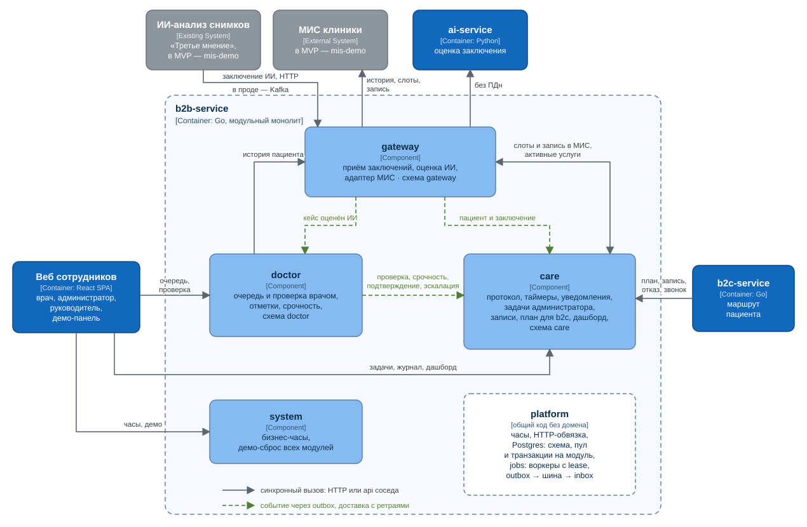

# Архитектура

Диаграммы в нотации [C4](https://c4model.com). Это обычные SVG-файлы, их можно править в любом редакторе.

## Уровень 2: контейнеры

- **Вход.** Путь стартует с заключения ИИ-анализа снимков. Это продукт «Третьего мнения», уже встроенный в контур клиники. В MVP он вызывает `POST /api/v1/reports` по HTTP (его имитирует mis-demo), в проде будет публиковать заключения в Kafka.
- **Контур клиники.** b2b-service, ai-service, PostgreSQL и веб сотрудников развёрнуты внутри периметра клиники, рядом с МИС и ИИ-анализом. ФИО, телефоны и тексты заключений хранятся только здесь.
- **Внешний контур.** b2c-service и веб пациента стоят рядом с сайтом и личным кабинетом клиники. b2c-service не хранит данных. Из b2b-service он получает только пациентскую проекцию плана: без диагнозов, находок, обоснований и срочности. Из МИС — визиты, слоты и запись.
- **Направление вызовов.** Внешний контур обращается внутрь по узкому набору ручек. Ни b2b-service, ни системы клиники не вызывают внешний контур.
- **ai-service.** Получает запрос без ПДн: возраст, пол, модальность, текст заключения и услуги. В MVP он обращается к облачному GigaChat, в проде модель должна работать on-prem или в российском контуре.

## Уровень 3: компоненты b2b-service

b2b-service — модульный монолит: один процесс, но модули изолированы так, чтобы их можно было вынести в отдельные сервисы.

- У каждого модуля своя схема Postgres, свой пул соединений и свой менеджер транзакций. Таблицы соседа модулю физически недоступны.
- Сосед доступен только через его пакет `api`. Синхронно — чтение и действия без общей транзакции.
- Изменения между модулями передаются событиями. Событие пишется в outbox модуля в той же транзакции, доставляется воркером с ретраями, подписчик запоминает его в inbox. Поэтому повторная доставка безопасна.
- Таймеры протокола считаются от времени события, а не от момента доставки.

Список событий, правила границ и порядок выноса модуля в отдельный сервис — в [README b2b-service](../../services/b2b-service/README.md).
